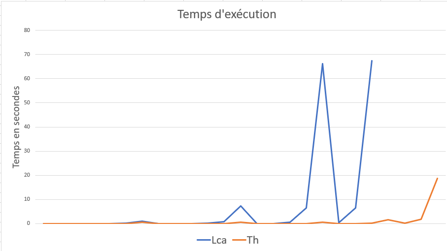

# Compte-rendu minimal du mini-projet SDA : LCA et TH

| Auteur       | PONT Sébastien |
| ------------ | -------------- |
| Groupe de TP | L2             |

**Consigne :** Vous devez écrire vos réponse à la place des ... en laissant
une ligne vide avant et deux après votre réponse.

**Remarque :** Ce document utilise le langage Markdown. On peut en engendrer
une version PDF en faisant par exemple :

```bash
pandoc --toc -N -o LISEZ-MOI.pdf LISEZ-MOI.txt
```

## Exercice 1

---

### Procedure `enregistrer`

Dans les retours spécifiques, vous m'avez dit :

> Dans Enregistrer: L'algorithme peut simplifier énormément si tu fusionnes le permier cas et le troisième.

Mon algorithme est :

```ada
procedure Enregistrer (Sda : in out T_Lca; Cle : in T_Cle; Donnee : in T_Donnee) is
  Sda_En_Cours : T_Lca;
begin
  Sda_En_Cours := Sda;

  while Sda_En_Cours /= null and then (Sda_En_Cours.all.Suivant /= null and Sda_En_Cours.all.Cle /= Cle) loop
      Sda_En_Cours := Sda_En_Cours.all.Suivant;
  end loop;

  if Sda = null then
      Sda            := new T_Cellule;
      Sda.all.Cle    := Cle;
      Sda.all.Donnee := Donnee;
  elsif Sda_En_Cours.all.Cle = Cle then
      Sda_En_Cours.all.Donnee := Donnee;
  elsif Sda_En_Cours.all.Suivant = null then
      Sda_En_Cours.all.Suivant            := new T_Cellule;
      Sda_En_Cours.all.Suivant.all.Cle    := Cle;
      Sda_En_Cours.all.Suivant.all.Donnee := Donnee;
  end if;

end Enregistrer;
```

Mais selon moi, on ne peut pas fusionner les 1er et 3ème cas car si `Sda` est `null`, alors, je ne peux pas "copier" la mémoire pointée par `Sda` dans un nouveau pointeur `Sda_En_Cours` car `Sda` ne pointe vers rien. Il faut donc que j'instencie d'abord `Sda` :

```ada
if Sda = null then
   Sda := new T_Cellule;
end if;
```

Maintenant je peux faire `Sda_En_Cours := Sda;`. Les deux pointeurs pointent vers la même mémoire (non affectée).

J'ai fait ça pour essayer de supprimer le 1er cas où j'affecte des valeurs directement à `Sda`. Mon idée est de pouvoir manipuler `Sda_En_Cours` dans tous les cas.

Continuons la procédure avec la boucle. Maintenant, la 1ère condition de sortie est inutile (`Sda_En_Cours /= null`) car il ne sera jamais `null` :

```ada
while Sda_En_Cours.all.Suivant /= null and Sda_En_Cours.all.Cle /= Cle loop
    Sda_En_Cours := Sda_En_Cours.all.Suivant;
end loop;
```

Considérons deux cas :

1. `Sda` était initiallement une liste chaînée non vide qui ne contenait pas la `Cle` à ajouter. On a donc fait des tours de boucles, et on est arrivé en fin de chaîne. `Sda_En_Cours` n'est pas `null`, mais `Sda_En_Cours.all.Suivant` l'est, et c'est lui qu'on veut instancier et affecter.
2. `Sda` était initiallement `null`, `Sda_En_Cours` est donc une nouvelle Cellule vide.

On voudrait alors trouver une condition qui permette de séparer ces deux cas pour continuer à travailler sur `Sda_En_Cours` :

```ada
if <...> then
  -- 1er cas
  Sda_En_Cours.all.Suivant := new T_Cellule;
  Sda_En_Cours := Sda_En_Cours.all.Suivant;
end if;

Sda_En_Cours.all.Cle := ...
```

En condition on peut penser à `Sda_En_Cours.all.Suivant = null`, mais dans les deux cas, c'est vrai.

Une bonne condition serait `Sda_En_Cours.all.Cle /= null`, mais lorsque j'exécute cette condition, j'obtiens l'erreur :

> left operator has private type "T_Cle"

Ca serait pareil pour `Donnee`, je ne trouve donc pas de conditions permettant de différencier les deux cas. Ainsi, selon moi on ne peux pas fusionner ces deux cas.

Mais vu que l'algorihtme peut être **_énormément_** simplifié, je suppose qu'il y a quand même une solution...

---

### Fuites de mémoire

Les fuites de mémoires ont été résolues. Valgrind retourne :

```console
HEAP SUMMARY:
    in use at exit: 0 bytes in 0 blocks
    total heap usage: 168 allocs, 168 frees, 11,968 bytes allocated

All heap blocks were freed -- no leaks are possible

For counts of detected and suppressed errors, rerun with: -v
ERROR SUMMARY: 0 errors from 0 contexts (suppressed: 0 from 0)
```

---

### Gestion des erreurs

> Très mauvaise gestion des exceptions. Il faut indiquer que le programme a rencontré un problème (afficher un message).

J'affiche maintenant le message `Erreur !` à chaque fois qu'une erreur est detectée, et je passe à la suite.

---

### Question 1.4

**Indiquer les inconvénients/avantages d'une implantation par listes chaînées
d'une SDA.**
| Avantages | Iconvéniants |
|--------------|----------------|
| 👍 Utiliser une liste chaînée permet de modifier au fur et à mesure la longueur de la SDA <br/> 👍 La mémoire est moins utilisée que pour un tableau de longueur défini|👎 Boucler à chaque fois que l'on veut accéder à une clé **ralentit** le programme <br/>👎Manipuler les pointers est plus complexe |

## Évaluation expérimentale

### Performance comparée de LCA et TH

Pour cela j'utilise un petit script bash :

```bash
#!/bin/bash
for borne in `seq 1 5`;
do
  for taille in `seq $borne 7` ;
  do
    ( time ./obj/evaluer_alea_lca $((10**$borne)) $((10**$taille)) ) >> resultats/bornes_lca.txt 2>> resultats/time_lca.txt

    ( time ./obj/evaluer_alea_th $((10**$borne)) $((10**$taille)) ) >> resultats/bornes_th.txt 2>> resultats/time_th.txt
  done
done
```

Avec un petit `grep` sur les lignes des fichiers `time_th.txt` et `time_lca.txt`, je récupère les temps 'users' que je trace dans un tableur :



Je n'ai pas fait tourner le script pour la LCA jusqu'au bout car c'était trop long... Mais on a compris, c'est beaucoup plus rapide avec les tables de Hachages ! 😮

### Qualité du générateur aléatoire

En regardans les fichiers `bornes_th.txt` et `bornes_lca.txt`, je trouve que la plus grande différence relative entre Min et Max est de `0.1%`.

Le générateur est de bonne qualité. 👌

## Principales difficultés rencontrées

Forcément la principale difficultée que j'ai rencontrée est celle de la fuite de mémoire avec des pointeurs mal compris.

J'ai utilisé GPS en mode debug étape par étape en regardans le contenu des pointeurs au fur et à mesure pour comprendre ce qu'il se passait.

Sinon il y a aussi mon problème expliqué précédemment pour la procédure `enregistrer`.

## Informations complémentaires

## Bilan personnel

J'ai bien aimé ce projet.
J'en ai profité pour bien prendre en main les outils gnat (`gprbuild`, `gnatpp`, `gnatstub`, `gdb`).

J'en ai profité pour mettre en place l'environnement de debug d'Ada dans mon IDE préféré : VS Code 😍
